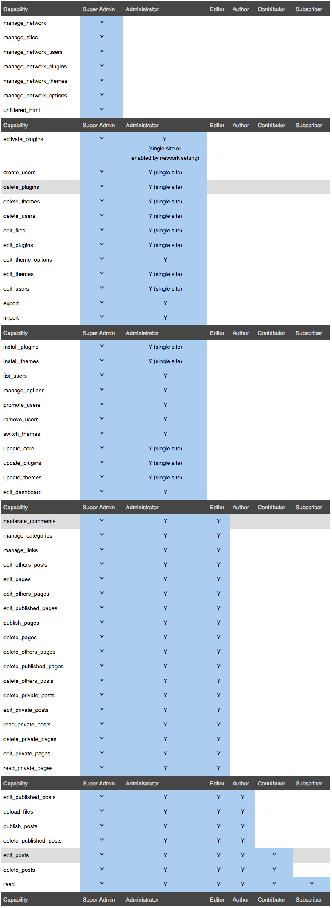

## 多种开发环境的集成
Laragon

# php 有用方法

```php
//远程请求 URL,一般会请求到网页的缓存,使用 curl_setopt 中的 CURLOPT_FRESH_CONNECT 参数 强制使用新的链接发送请求
function curl_file_get_contents($durl){
    $ch = curl_init();
    curl_setopt($ch, CURLOPT_URL, $durl);
    curl_setopt($ch, CURLOPT_TIMEOUT, 5);
    curl_setopt($ch, CURLOPT_USERAGENT, _USERAGENT_);
    curl_setopt($ch, CURLOPT_REFERER,_REFERER_);
    //CURLOPT_FRESH_CONNECT TRUE可强制使用新的连接,远离请求缓存
    curl_setopt($ch, CURLOPT_FRESH_CONNECT, TRUE);
    curl_setopt($ch, CURLOPT_RETURNTRANSFER, 1);
    $r = curl_exec($ch);
    curl_close($ch);
    return $r;
}

// 阶乘
function factorial($n) {
    return array_product(range(1, $n));
}
 
// 排列数
function A($n, $m) {
    return factorial($n)/factorial($n-$m);
}
 
// 组合数
function C($n, $m) {
    return A($n, $m)/factorial($m);
}
 
// 排列
function arrangement($a, $m) {
    $r = array();
    $n = count($a);
    if ($m <= 0 || $m > $n) {
        return $r;
    }
    for ($i=0; $i<$n; $i++) {
        $b = $a;
        $t = array_splice($b, $i, 1);
        if ($m == 1) {
            $r[] = $t;
        } else {
            $c = arrangement($b, $m-1);
            foreach ($c as $v) {
                $r[] = array_merge($t, $v);
            }
        }
    }
    return $r;
}
 
// 组合
function combination($a, $m) {
    $r = array();
    $n = count($a);
    if ($m <= 0 || $m > $n) {
        return $r;
    }
    for ($i=0; $i<$n; $i++) {
        $t = array($a[$i]);
        if ($m == 1) {
            $r[] = $t;
        } else {
            $b = array_slice($a, $i+1);
            $c = combination($b, $m-1);
            foreach ($c as $v) {
                $r[] = array_merge($t, $v);
            }
        }
    }
    return $r;
}


```

## WORDPRESS 角色权限图



# github 访问不了时 
访问 http://tool.chinaz.com/nslookup/
将 github.com 放在 域名查询哪里 就可以得到 服务器的真实地址 然后C:\Windows\System32\drivers\etc\hosts 添加下面一行记录即可

## 13.250.177.223 github.com

#利用Beautiful Soup+Pandas+Pyqt5+Selenum进行python爬虫
http://www.showerlee.com/archives/2109
采用PyQt5+urllib3+BeautifulSoup4进行动态网页的图片抓取爬虫
https://blog.csdn.net/And_ZJ/article/details/80003543

# css 
div固定底部 并且不遮挡其他元素

问题：设置固定底部的div后会遮挡其他元素
解决方法:为该固定在底部的div设置一个height，position设置为fixed，
然后给body设置一个margin-bottom，大小为该固定在底部的div的height
